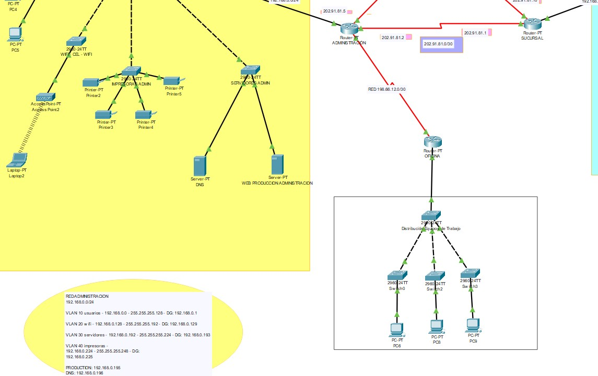
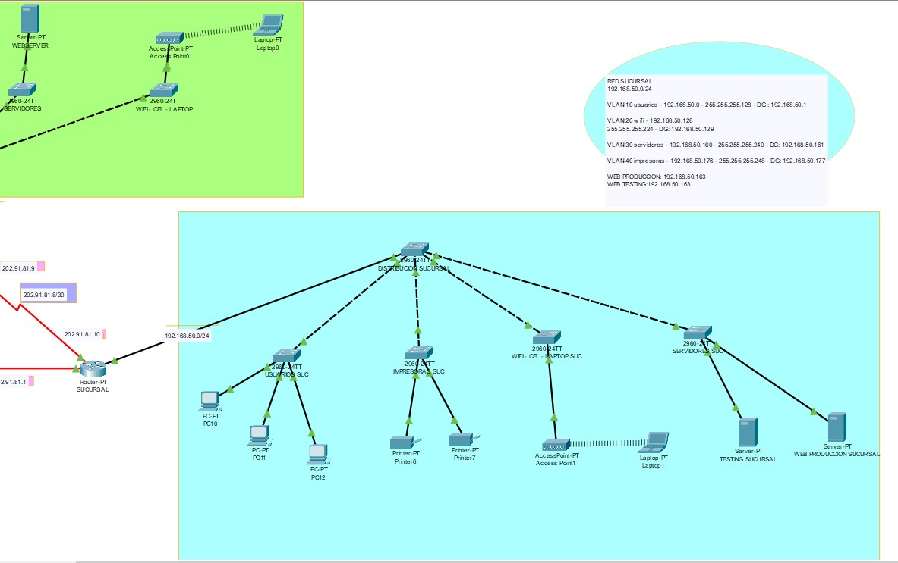
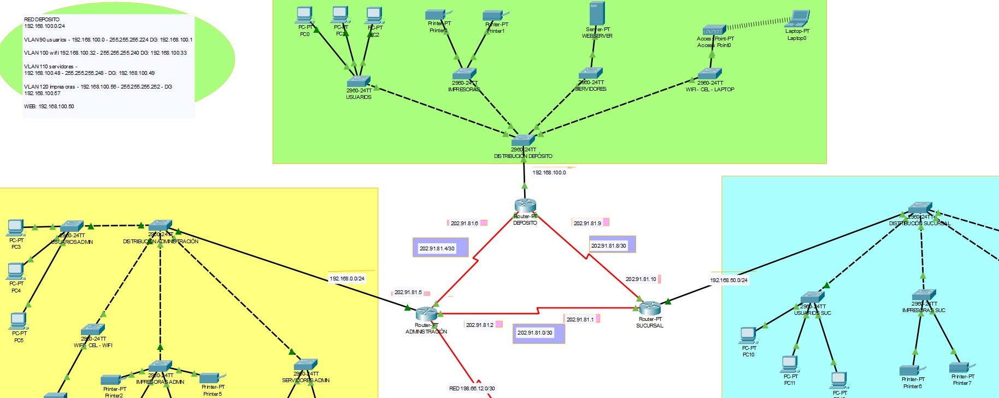

# Enterprise Network VLANs

Laboratorio de redes empresariales con segmentación por VLANs, desarrollado originalmente en 2021 y reutilizado en 2026 como parte de prácticas avanzadas en ciberseguridad y certificaciones Cisco. Incluye subneteo detallado, configuración de DHCP/VTP, simulación en Cisco Packet Tracer, documentación técnica, planillas en Excel y diagramas visuales.

---

## 🎯 Objetivos
- Implementar segmentación de red mediante VLANs en entornos empresariales  
- Aplicar técnicas de subneteo detallado para optimizar direcciones IP  
- Configurar servicios seguros: DHCP, DNS, VTP y servidores web  
- Documentar topologías y configuraciones para uso educativo y profesional  
- Reutilizar infraestructura como laboratorio de ciberseguridad y simulación de ataques/defensas  

---

## 📦 Estructura del proyecto
- `diagrams/` : Diagramas visuales en formato draw.io  
- `docs/` : Documentación técnica en PDF  
- `packet-tracer/` : Archivo `.pkt` de Cisco Packet Tracer  
- `excel/` : Planillas de subneteo en Excel  
- `images/` : Capturas y exportaciones visuales  

---

## 📚 Aplicación en ciberseguridad
Este diseño sirve como base para:
- Simulaciones de ataques y defensas en redes segmentadas  
- Prácticas de configuración segura de servicios  
- Laboratorios de análisis de tráfico y detección de anomalías  
- Entrenamiento en protocolos de enrutamiento y gestión de VLANs  

---

## 📸 Capturas de topología

### Administración

### Sucursal

### Depósito

---

## 📄 Documentación técnica

[📥 Descargar PDF de configuración](docs/Cálculo-subneteo.pdf)

---

## 📊 Planilla de subneteo
[📥 Descargar Excel](excel/Administracion-Sucursal-Deposito.xlsx)

---

## 🧪 Simulación en Cisco Packet Tracer
[📥 Descargar archivo .pkt](packet-tracer/infraestructura-vlan.pkt)

---

## 🖼 Diagramas visuales
[📥 Descargar diagrama editable (.drawio)](diagrams/infraestructura-vlan.drawio)

---

## 🛠 Tecnologías utilizadas
- Cisco Packet Tracer  
- draw.io  
- Excel  
- Protocolos: VLAN, DHCP, VTP, RIP  

---

## 🧾 Créditos y contexto histórico
Este proyecto fue desarrollado originalmente como parte de un examen práctico en 2021, y reutilizado en 2026 como portafolio técnico para cursos de ciberseguridad y certificaciones Cisco.  
Su evolución refleja la importancia de la segmentación de redes y la documentación profesional en entornos académicos y laborales.  
